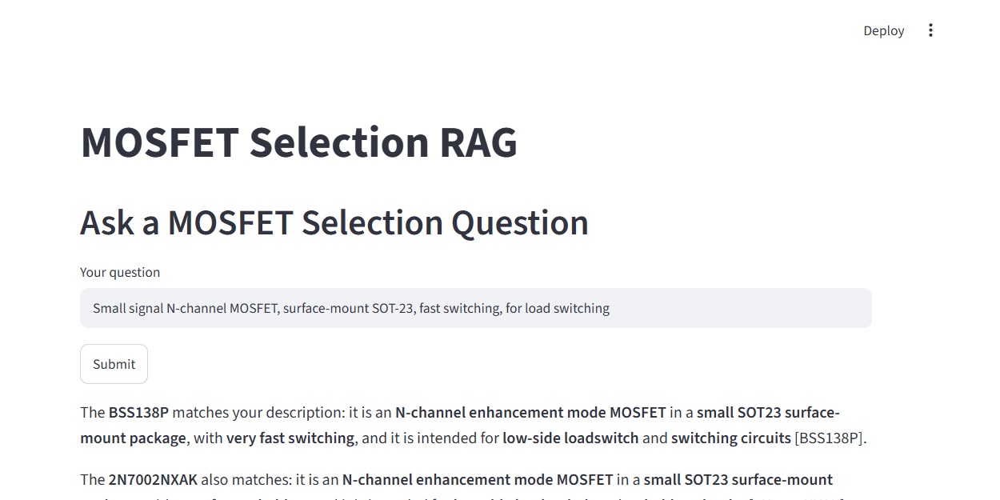
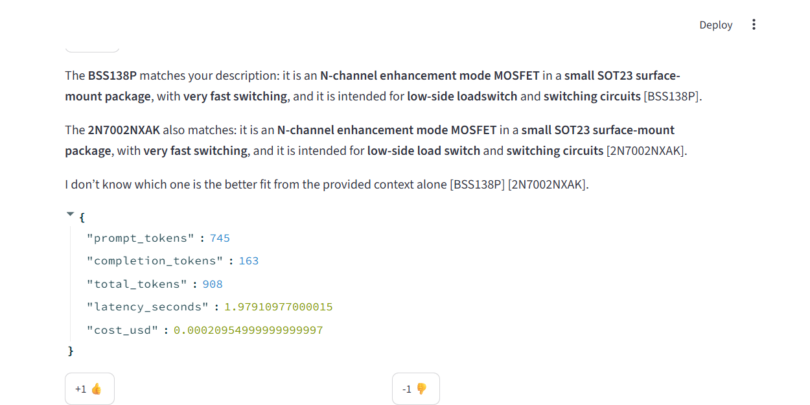
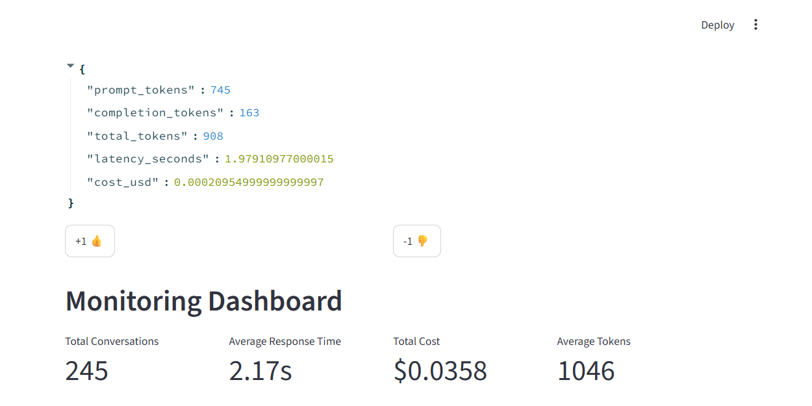
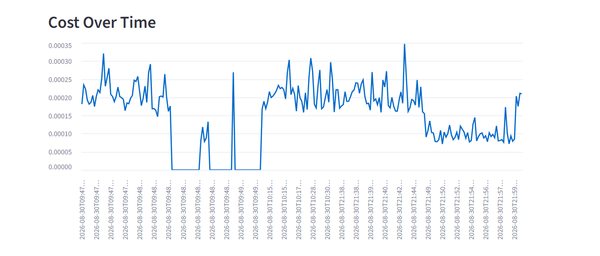
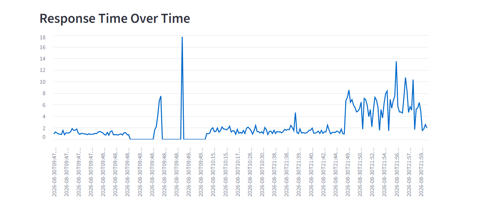
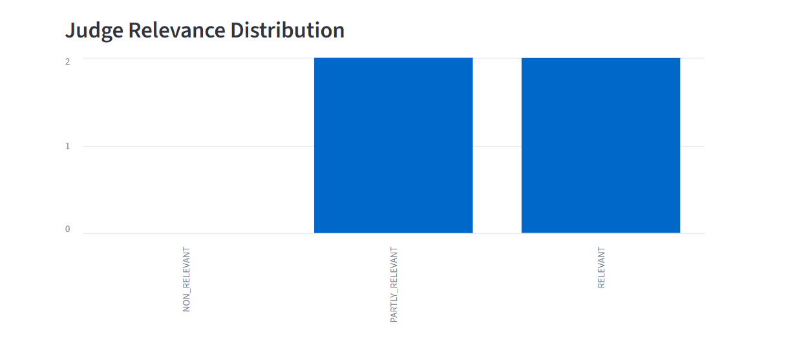
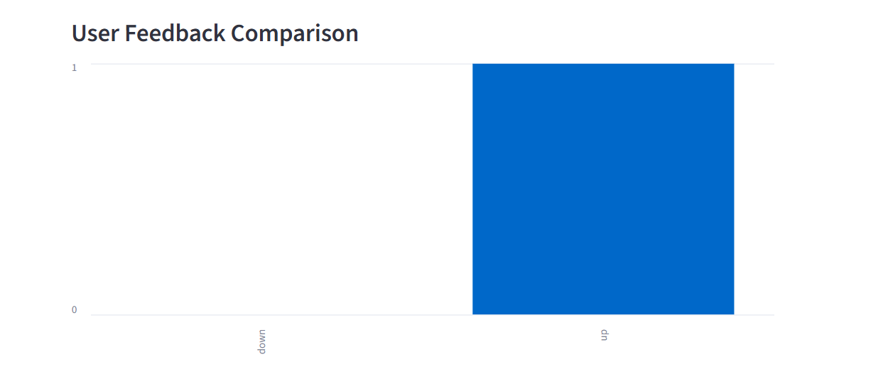

# MOSFET Selection RAG Application

A Retrieval-Augmented Generation (RAG) app that lets an electronics
design engineer describe what they need in plain English — *"I want a
MOSFET for a fast-switching application, with RoHS compliance"* — and
get back a grounded answer citing real part numbers from a local
library of manufacturer datasheets, instead of having to manually skim
PDFs.

This README explains the problem, the data, how the system works, how
every project evaluation criterion is satisfied, and how to run it
yourself (locally or via Docker).

---

## Table of contents

1. [The problem, the data, and the flow](#1-the-problem-the-data-and-the-flow)
2. [How each evaluation criterion is met](#2-how-each-evaluation-criterion-is-met)
3. [Screenshots](#3-screenshots)
4. [Setup](#4-setup)
5. [Running the pipeline](#5-running-the-pipeline)
6. [Example query / answer](#6-example-query--answer)
7. [Dataset](#7-dataset)
8. [Cloud deployment (bonus)](#8-cloud-deployment-bonus)
9. [Project structure](#9-project-structure)
10. [Further reading](#10-further-reading)

---

## 1. The problem, the data, and the flow

**Problem.** Selecting a MOSFET for a design means cross-referencing
dozens of datasheet PDFs for package type, switching speed, ESD
protection, RoHS compliance, and application notes. That's slow and
error-prone to do by hand.

**Data.** A small library of real manufacturer MOSFET datasheets (PDF,
first page only — the page that contains the description, features,
and applications summary) lives under `data/raw/`. Each datasheet is
parsed into structured fields, embedded, and stored in a local SQLite
knowledge base.

**Flow.** A user's question goes through a multi-stage pipeline before
an LLM ever sees it:

```
                    ┌───────────────────────── Streamlit UI ─────────────────────────┐
                    │   [ Q&A Panel ]                    [ Monitoring Dashboard ]     │
                    └───────┬─────────────────────────────────────────▲──────────────┘
                            │ user query                               │ telemetry / feedback
                            ▼                                          │
   Stage 0: Query Rewrite (LLM) ─► Stage 1: Hybrid Search (FTS5 + Vector)
                            │                                          │
                            ▼                                          │
   Stage 2: Cross-Encoder Re-rank (ONNX) ─► Top-N context ─► RAG Generation (LLM Abstraction)
                            │                                          │
                            ├──────────► LLM-as-Judge relevance ───────┤
                            ▼                                          ▼
                    conversations table  ◄──── FK ────►  feedback table   (monitoring.db, SQLite)

   Offline: dlt Ingestion (PDF page 1) ─► master_table (knowledge.db, SQLite + vector ext)
   Offline: Evaluation (retrieval + LLM) ─► results JSON/CSV ─► winner written to config.py
```

- **Stage 0 — Query rewrite:** the raw question is expanded by an LLM
  (e.g. "RoHS" → "RoHS compliant / lead-free") before retrieval.
- **Stage 1 — Hybrid search:** SQLite FTS5 (BM25 keyword search) and a
  local ONNX embedding model (cosine vector search via `sqlite-vec`)
  each return candidates, fused into one ranked list.
- **Stage 2 — Re-ranking:** a local ONNX cross-encoder re-scores the
  candidates for relevance and keeps the top few as context.
- **Generation:** an LLM (OpenAI or Google Gemini, swappable) answers
  strictly from that context and cites part numbers.
- **Judging & monitoring:** every answer is automatically graded for
  relevance by a second LLM call, and every conversation (tokens,
  latency, cost) plus user 👍/👎 feedback is logged to a local SQLite
  monitoring database, visualized on a dashboard.

**Data privacy principle:** the knowledge base and monitoring store are
local SQLite files, and embedding/re-ranking inference run **locally on
CPU via ONNX** — no document content or search vectors are sent to any
external service. Only the final generation/judge prompts (query +
retrieved datasheet excerpts) go to the configured cloud LLM provider.

---

## 2. How each evaluation criterion is met

| Criterion | How it's met | Where |
|---|---|---|
| **Query rewriting** before retrieval | Stage 0 LLM call expands acronyms/technical terms | [`src/retrieval/query_rewriter.py`](src/retrieval/query_rewriter.py) |
| **Hybrid search** (lexical + vector) | SQLite FTS5 BM25 + `sqlite-vec` cosine similarity, weighted fusion `α·vector + (1-α)·keyword`, plus Reciprocal Rank Fusion (RRF) as an alternative | [`src/retrieval/hybrid_search.py`](src/retrieval/hybrid_search.py) |
| **Re-ranking** | Local ONNX cross-encoder (`ms-marco-MiniLM-L-6-v2`) re-scores and sorts candidates | [`src/retrieval/reranker_stage.py`](src/retrieval/reranker_stage.py) |
| **4 retrieval approaches compared** | Lexical-only, dense-vector-only, hybrid (RRF), hybrid+rerank with an **α sweep from 0.0 to 1.0** | [`src/evaluation/evaluate_retrieval.py`](src/evaluation/evaluate_retrieval.py), results below |
| **Retrieval metrics** | Hit Rate (Recall@5) and Mean Reciprocal Rank (MRR), computed per approach/variant | [`data/retrieval_eval_results.json`](data/retrieval_eval_results.json) / `.csv` |
| **Automated winner selection** | Best (approach, α) picked by MRR (tie-break Hit Rate) and written back into `src/config.py` so production retrieval uses it automatically | [`src/config.py`](src/config.py) (`ACTIVE_RETRIEVAL_APPROACH`, `ACTIVE_ALPHA`) |
| **LLM provider abstraction / model swap** | One `LLMClient` interface; OpenAI and Gemini both implement it; a single factory function switches between them everywhere (query rewrite, generation, judge, evaluation) | [`src/llm/base.py`](src/llm/base.py), [`src/llm/factory.py`](src/llm/factory.py) |
| **A → Q → A′ LLM evaluation, two backbones** | For every ground-truth (question, source-answer) pair, both OpenAI `gpt-5.4-mini` and Gemini `gemini-2.5-flash` generate an answer; a third LLM call judges semantic equivalence (`good`/`bad`) | [`src/evaluation/evaluate_llm.py`](src/evaluation/evaluate_llm.py) |
| **LLM-as-judge, structured output** | Pydantic `JudgeVerdict{verdict, reasoning}` for offline eval; `RelevanceVerdict{label, explanation}` for live production judging | [`src/evaluation/evaluate_llm.py`](src/evaluation/evaluate_llm.py), [`src/rag/judge.py`](src/rag/judge.py) |
| **Parallel batch evaluation** | `ThreadPoolExecutor`, sequential-per-model / parallel-within-model | [`src/evaluation/evaluate_llm.py`](src/evaluation/evaluate_llm.py) |
| **Accuracy / cost / latency / failure analysis + winner logic** | Aggregated per model, `bad`-verdict rows categorized (`hallucination` / `irrelevant_context`), winner picked by accuracy → failures → cost | [`data/llm_eval_results.json`](data/llm_eval_results.json) / `.csv` |
| **Ground truth generation** | ~5 realistic engineering questions per datasheet record, structured `Questions{questions}` output | [`src/evaluation/generate_ground_truth.py`](src/evaluation/generate_ground_truth.py) → [`data/ground_truth.csv`](data/ground_truth.csv) |
| **Monitoring: token/latency/cost capture** | Every LLM call intercepted and logged with a timezone-aware UTC timestamp | [`src/db/monitoring_store.py`](src/db/monitoring_store.py), [`src/rag/generator.py`](src/rag/generator.py) |
| **Dual feedback (user + judge)** | 👍/👎 buttons write `source="user"`; the live judge writes `source="judge"` — both FK-linked to `conversations` | [`src/app/qa_panel.py`](src/app/qa_panel.py), [`src/rag/judge.py`](src/rag/judge.py) |
| **Monitoring dashboard, exactly 5 items** | KPIs, cost over time, response time over time, judge relevance distribution, user feedback comparison | [`src/app/dashboard.py`](src/app/dashboard.py) |
| **Containerized, single command** | `docker-compose.yml` + `Dockerfile`, one `app` service (Streamlit + all offline pipeline stages) | [`docker-compose.yml`](docker-compose.yml), [`Dockerfile`](Dockerfile) |
| **Task runner** | `make build / export-models / ingest / ground-truth / eval-retrieval / eval-llm / up / down` | [`Makefile`](Makefile) |
| **Reproducibility** | Every dependency pinned with `==` | [`requirements.txt`](requirements.txt) |

### Retrieval evaluation results (real run, 50 ground-truth queries, 10 datasheets)

| Approach | Variant | Hit Rate@5 | MRR | Winner |
|---|---|---|---|---|
| Lexical (BM25) | `lexical_bm25` | 0.98 | 0.907 | |
| Dense vector | `dense_vector` | 0.96 | 0.774 | |
| Hybrid (RRF) | `hybrid_rrf` | 1.00 | 0.830 | |
| Hybrid + rerank | `alpha=0.0 … 1.0` (all tied) | 1.00 | 0.930 | ✅ `alpha=0.0` |

*(All 11 α values scored identically at this corpus size — with only 10
documents, the cross-encoder re-ranker fully determines the final
ranking regardless of the lexical/vector fusion weight. This is a
genuine finding of the evaluation, not a bug — see
[`docs/PROJECT_NOTES.md`](docs/PROJECT_NOTES.md) for the analysis, and
re-check once the corpus grows.)*

Winner **`hybrid_rerank`, α=0.0** was written automatically into
`src/config.py`'s `ACTIVE_RETRIEVAL_APPROACH` / `ACTIVE_ALPHA`.

### LLM evaluation results (real run, 50 ground-truth queries, both backbones)

| Model | Judged | Failures | Accuracy | Total cost | Avg latency |
|---|---|---|---|---|---|
| OpenAI `gpt-5.4-mini` | 49/50 | 1 | 85.71% | $0.0135 | 1.45 s |
| Gemini `gemini-2.5-flash` | 50/50 | 0 | 86.00% | $0.0149 | 5.92 s |

Winner: **Gemini** (ranked by accuracy, then failure count, then cost —
effectively a statistical toss-up at this sample size, decided by the
zero-failures tiebreak). `DEFAULT_LLM_PROVIDER` was deliberately left as
`"openai"` in `src/config.py` — the evaluation winner is *not*
auto-applied to production, by design; a maintainer can change it after
reviewing the full report in `docs/PROJECT_NOTES.md`.

Failure analysis of `bad`-verdict rows: OpenAI — 6 hallucination, 1
irrelevant-context; Gemini — 5 hallucination, 2 irrelevant-context.

---

## 3. Screenshots

**Q&A panel** — user submits a natural-language MOSFET selection query:



**Example answer** — generated recommendation with citations, token/cost/latency metrics, and 👍/👎 feedback buttons:



**Monitoring dashboard** — KPI summary (total conversations, average response time, total cost, average tokens):



**Dashboard charts** — cost, latency, judge relevance, and user feedback trends over time:

| Cost over time | Response time over time |
|---|---|
|  |  |

| Judge relevance distribution | User feedback comparison |
|---|---|
|  |  |

---

## 4. Setup

### 4.1 Prerequisites

- Python 3.11 (for local/venv setup), **or** Docker + Docker Compose
  (for containerized setup — no local Python required).
- An OpenAI API key and/or a Google Gemini API key.

### 4.2 Environment variables

Copy [`.env.example`](.env.example) to `.env` and fill in your keys:

| Variable | Purpose | Required |
|---|---|---|
| `OPENAI_API_KEY` | OpenAI `gpt-5.4-mini` access | For the OpenAI backbone |
| `GEMINI_API_KEY` / `GOOGLE_API_KEY` | Google `gemini-2.5-flash` access | For the Gemini backbone |

At least one is required; both are required to run the full
`make eval-llm` model-swap comparison. `.env` is gitignored and never
committed.

### 4.3 Local (virtualenv) setup

```powershell
py -3.11 -m venv .venv
.venv\Scripts\activate
pip install -r requirements.txt
copy .env.example .env
# edit .env with your real API keys
```

> **Windows note:** `onnxruntime` requires the Microsoft Visual C++
> 2015–2022 Redistributable (x64) to import correctly. If you see a
> `DLL load failed while importing onnxruntime_pybind11_state` error,
> install it via
> `winget install --id Microsoft.VCRedist.2015+.x64 -e`.

### 4.4 Docker setup (no local Python required)

```powershell
copy .env.example .env
# edit .env with your real API keys
docker compose build
docker compose up -d
```

The container auto-exports the ONNX models on first start if
`./models` is empty (may take a few minutes the very first time), then
serves Streamlit at **http://localhost:8501**. `./data` and `./models`
are bind-mounted so the knowledge base, monitoring database, and ONNX
exports persist across container restarts.

Stop the stack with `docker compose down` (or `make down`).

---

## 5. Running the pipeline

Every stage is runnable through `make` (locally) or
`docker compose run --rm app <command>` (containerized):

| Command | What it does |
|---|---|
| `make export-models` | Export both HF models (embedder + reranker) to ONNX under `models/` |
| `make ingest` | Run the `dlt` ingestion pipeline over `data/raw/*.pdf` into `data/knowledge.db` |
| `make ground-truth` | Generate `data/ground_truth.csv` (~5 questions per datasheet) |
| `make eval-retrieval` | Compare 4 retrieval approaches, write results + winner to `src/config.py` |
| `make eval-llm` | Compare OpenAI vs Gemini backbones (accuracy/cost/latency/failures) |
| `make up` / `make down` | Start / stop the full Docker stack |

Run them in order the first time: `export-models` → `ingest` →
`ground-truth` → `eval-retrieval` → `eval-llm` → `up`.

To launch just the UI without Docker:

```powershell
streamlit run src/app/streamlit_app.py
```

---

## 6. Example query / answer

**Query:**
> Small signal N-channel MOSFET, surface-mount SOT-23, fast switching,
> intended for switching circuits and load switching

**Answer (generated, OpenAI backbone):**
> Identifies **2N7002NXAK** — an N-channel enhancement-mode MOSFET in a
> SOT23 (TO-236AB) surface-mount package, rated for very fast switching,
> intended for low-side load-switch and general switching circuit
> applications — with a close alternative part also listed.

**Execution metrics shown alongside the answer:** prompt/completion/total
tokens, latency (seconds), and estimated cost (USD) — captured for every
conversation and visualized on the monitoring dashboard.

*(Judge verdict on this example: `good` — the generated answer is
factually consistent with the source datasheet and directly answers the
question.)*

---

## 7. Dataset

Raw datasheet PDFs live under [`data/raw/`](data/raw) and **are committed
to this repository** — cloning the repo is sufficient, no separate
download step is required before running `make ingest`:

> **Dataset:** [`data/raw/`](https://github.com/Pickausrname/llm-zoomcap-2026-Project/tree/main/data/raw) — 10 MOSFET datasheet PDFs (BSS138P, 2N7002NXAK, FDMC89521L, FDV301N, NX3020NAKW, SSM3K2615R, T2N7002AK, XP3N035N, RE1C002UNTCL, RK7002BMT116).

Only the **first page** of each PDF is parsed (component type,
manufacturer, part number, plus Descriptions/Features/Applications
text, concatenated and embedded). The extraction heuristic is adapted
from [`skills/datasheet-1.0.0/SKILL.md`](skills/datasheet-1.0.0/SKILL.md)
and gracefully skips any section a given datasheet doesn't contain
(different manufacturers use different heading text) — a datasheet
missing a section still gets ingested with a partial `search_text`
rather than failing the run.

---

## 8. Cloud deployment (bonus)

Deploying the full stack to a standard cloud VM (AWS EC2, DigitalOcean
Droplet, etc.):

1. **Provision a VM** (e.g. Ubuntu 22.04/24.04 LTS, a small/medium
   instance is sufficient — CPU-only ONNX inference, no GPU required).
   Open inbound TCP port **8501** in the VM's security group / firewall.
2. **Install Docker + Compose** on the VM:
   ```bash
   curl -fsSL https://get.docker.com | sudo sh
   sudo usermod -aG docker $USER   # log out/in to apply
   sudo apt-get install -y docker-compose-plugin
   ```
3. **Copy the repository** to the VM (`git clone ...` or `scp`), then
   `cd` into it.
4. **Set up secrets:**
   ```bash
   cp .env.example .env
   nano .env   # fill in OPENAI_API_KEY / GEMINI_API_KEY
   ```
5. **Build and start the stack** (the dataset in `data/raw/` — see
   [§7](#7-dataset) — comes with the clone, no separate download needed):
   ```bash
   docker compose build
   docker compose up -d
   ```
6. **Run the offline pipeline once** (ingestion, ground truth, evaluation)
   inside the running container:
   ```bash
   docker compose exec app python -m src.ingestion.pipeline
   docker compose exec app python -m src.evaluation.generate_ground_truth
   docker compose exec app python -m src.evaluation.evaluate_retrieval
   docker compose exec app python -m src.evaluation.evaluate_llm
   ```
7. **Open the app** at `http://<vm-public-ip>:8501`.
8. To update later: `git pull`, then `docker compose up -d --build`.

`./data` and `./models` are bind-mounted on the VM's local disk, so the
knowledge base, monitoring database, and ONNX exports all persist across
container restarts and redeploys.

---

## 9. Project structure

```
├── .env.example              # Secrets template (copy to .env)
├── docker-compose.yml        # Single-command orchestration
├── Dockerfile                # App image (Python 3.11-slim)
├── docker-entrypoint.sh       # Auto-exports ONNX models on first container start
├── Makefile                  # make ingest | eval-retrieval | eval-llm | up | down | ...
├── requirements.txt           # Pinned dependency versions
├── data/                      # SQLite DBs, eval results, raw PDFs (gitignored except structure)
├── models/                    # ONNX exports (generated, gitignored)
├── skills/datasheet-1.0.0/    # Reference extraction guide adapted by pdf_extractor.py
├── docs/PROJECT_NOTES.md      # Full build log: every decision, bug, and fix made during development
└── src/
    ├── config.py               # Central config; winning retrieval approach + α written here
    ├── db/                     # knowledge_store.py, monitoring_store.py
    ├── ingestion/               # dlt pipeline, PDF extraction
    ├── models_onnx/             # ONNX export + embedder + reranker
    ├── retrieval/               # query rewrite, hybrid search, re-ranking, pipeline
    ├── llm/                     # provider-agnostic LLM abstraction (OpenAI / Gemini)
    ├── rag/                     # generator + built-in relevance judge
    ├── evaluation/               # ground truth, retrieval eval, LLM eval
    └── app/                     # Streamlit UI (Q&A panel + monitoring dashboard)
```

---

## 10. Further reading

- [`SPEC.MD`](SPEC.MD) — the full technical specification this project
  was built against.
- [`docs/PROJECT_NOTES.md`](docs/PROJECT_NOTES.md) — the complete,
  chronological build log: every implementation decision, bug found,
  fix applied, and evaluation result, in detail.
